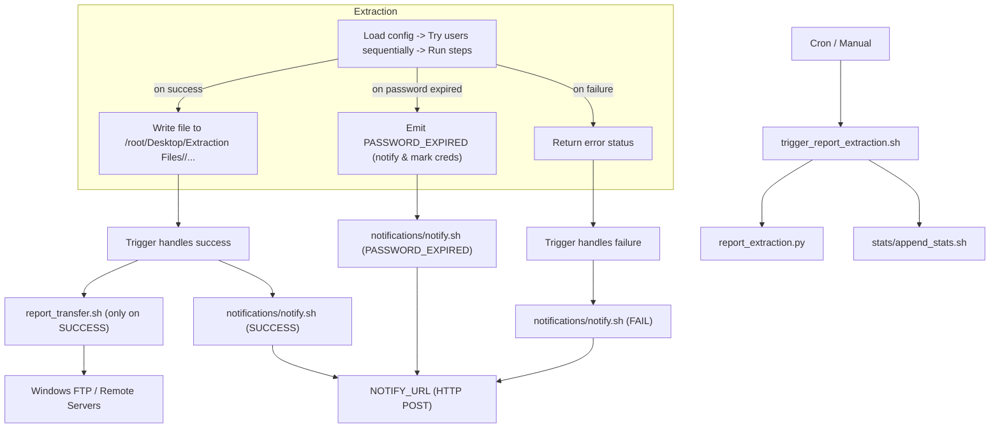
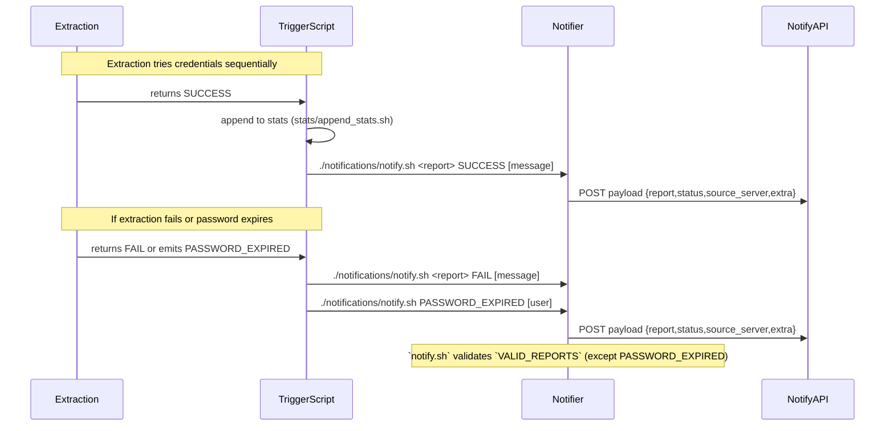

# README

## Running the Script

To run the extraction script with an activated environment, follow these steps:

<h1>Linux</h1>

### Project path:

<pre>

cd /root/Desktop/extraction-automation-main/

</pre>

### Activate the Environment:

Environment is already available.

<pre>

source env_automation/bin/activate

</pre>

### Run the Script Manually:

<pre>

./trigger_report_extraction.sh [report] [period=optional]

</pre>

Available Reports:

- duk008

- accruals

- provision

- ic01

Period format (only the report ic01 allows period):

- yyyy-mm-dd

- 2024-05-01

<h2>Manage Environment:</h2>

  <h3>Create Virtual Environment:</h3>

  <pre>

  python3 -m venv env_automation

  </pre>

  Install Dependencies:

  <pre>

  pip install -r requirements.txt

  </pre>

<h2> Setup for Extraction Process Using Firefox (Linux)</h2>

When performing the extraction, Firefox is utilized. However, if there is a need to change the server, it's important to be aware of some settings that may cause issues. This setting can be addressed by following the steps outlined below:

<b>Install Firefox 48.0</b>

We are using the Firefox 48.0 version because this version allow to run java applte applaication , that newer version dont allow.

Source: <a href=https://ftp.mozilla.org/pub/firefox/releases/48.0/>firefox-48.0.linux-x86_64.sdk.tar.bz2</a>

Settings:

- On Content <a href="about:preferences#content">about:preferences#content</a>:

    - Allow Pop-ups

- On Advanced > Update <a href="about:preferences#advanced">about:preferences#advanced</a>:

    - Never check for updates

<b>How to install Oracle Java Plugin (32bit) (Linux)</b>

Tutorial : <a href="https://www.youtube.com/watch?v=Be7Cz8HZTcU">Youtube</a>

Using JRE version - jre1.7.0_80 (available on <a href="https://www.oracle.com/java/technologies/javase/javase7-archive-downloads.html">Oracle</a>)

Follow the tutorial, but instead of using:

- jre1.7.0_80/lib/i368/libnpjp2.so

 use instead the :

 - jre1.7.0_80/lib/amd64/libnpjp2.so

Steps:

<pre>

cd

mkdir -p .mozilla/plugins

rm .mozilla/plugins/libnpjp2.so

</pre>

<pre>

ln -s /root/Desktop/Java/jre1.7.0_80/lib/amd64/libnpjp2.so ~/.mozilla/plugins/libnpjp2.so

</pre>

Note:

In case the certificate gets error (happens once ina while):

<pre>

cd /root/Desktop/Java/jre1.7.0_80/bin/

./ControlPanel

</pre>

Open "Advanced" Tab -> on entry "Check for signed code certificate revocation using" -> Check option "Certificate Revocation Lists (CRLs)"

<h2>Triggering Extraction with cron:</h2>

cron allows scheduling commands to run at specific times. Here's how to set up a cron job for automatic extractions:

  <h3>Open crontab (root):</h3>

  <pre>

  sudo crontab -u root -e

  </pre>

  Add Cron Job:

  <pre>

  0 8 * * * /root/Desktop/extraction-automation-main/trigger_report_extraction.sh duk008 >> /root/Desktop/extraction-automation-main/extraction.log 2>&1

   </pre>

  <pre>

  0 0-7 * * * /root/Desktop/extraction-automation-main/load_schedule.sh >> /root/Desktop/extraction-automation-main/extraction.log 2>&1

 </pre>

 <pre>

  0 9-23 * * * /root/Desktop/extraction-automation-main/load_schedule.sh >> /root/Desktop/extraction-automation-main/extraction.log 2>&1

  </pre>

  <h3>Explanation:</h3>

<table>

  <tr>

    <th>Field</th>

    <th>Description</th>

  </tr>

  <tr>

    <td>Minute</td>

    <td>30 </td>

  </tr>

  <tr>

    <td>Hour</td>

    <td>14 (2 PM)</td>

  </tr>

  <tr>

    <td>Day of Month, Month, Day of Week</td>

    <td>* (Every)</td>

  </tr>

  <tr>

    <td>Command with name of report to extract</td>

    <td>/path/to/your/script/trigger_report_extraction.sh duk008</td>

  </tr>

</table>

Note: Currently the duk008 job runs everyday at 8 AM.

And the job to check schedule reports runs every hour evry except at 8AM.

<h2>Project Structure:</h2>

This document outlines the structure and functionality of the project's various scripts.

<h3>Scripts</h3>

<ul>

<li><strong>report_extraction.py:</strong>

<ul>

<li>This Python script takes the report name (and an optional period) as arguments.</li>

<li>If the report name is valid, it retrieves the necessary extraction steps from a JSON file located in the <code>config</code> folder for that specific report.</li>

<li>Logs are generated throughout the process to track progress and potential failures. These logs are stored in two files: <code>extraction.log</code> and <code>activity_logs.log</code>.</li>

<li>Screenshots are captured for each step during execution and saved in the <code>screenshots</code> folder.</li>

<li>The final extracted report is placed in the designated folder within the <code>/root/Desktop/Extraction Files/</code> directory.</li>

</ul>

</li>

<li><strong>trigger_report_extraction.sh:</strong>

<ul>

<li>This Bash script is designed to be run through crontab for scheduled execution.</li>

<li>It calls the Python script <code>report_extraction.py</code>, which handles the entire extraction process.</li>

<li>Upon successful execution of the Python script, it triggers another Bash script, <code>report_transfer.sh</code>.</li>

</ul>

</li>

<li><strong>report_transfer.sh:</strong>

<ul>

<li>This Bash script is responsible for transferring the extracted report from the Linux server (/root/Desktop/Extraction Files/[report]) to the Windows server globalardwh.equant.com (specifically the directory D:\ExtractionData\ExternalReception\[REPORT]).</li>

</ul>

</li>

<li><strong>check_schedule.py:</strong>

<ul>

<li>This Python script reads the schedule.json file and retrieves the report name scheduled for extraction within the current day and the following hour.</li>

<li>If a report is scheduled, it can also retrieve the corresponding extraction period.</li>

</ul>

</li>

<li><strong>load_schedule.sh:</strong>

<ul>

<li>This script handles downloading the updated schedule.json file from the Windows server to the Linux server.</li>

<li>Additionally, it triggers the execution of check_schedule.py. Based on the output of this script (which report and period are scheduled), it initiates the extraction process for the designated report by calling trigger_report_extraction.sh.</li>

</ul>

</li>

</ul>

## Diagrams

Below are two Mermaid diagrams that explain the main flows in this project: the high-level extraction/transfer flow and the notification flow.

### High-level Flow

### Notification Flow (details)

Notes:

- `VALID_REPORTS` in the project's `.env` controls which report names `notify.sh` accepts. Add `DUK008_XLS` (uppercase with underscore) if notifications for that report are blocked.
- The `notify.sh` behavior: it posts JSON to `NOTIFY_URL` and may also update/upload local notification files to FTP depending on configuration.

<h1>Windows</h1>

### Activate the Environment:

Environment is already available.

#### Windows:

<pre>

.\env_duk008\Scripts\activate

</pre>

### Run the Script:

#### Windows:

<pre>

.\extraction_DUK008.py

</pre>

## Manage Environment:

### Create Virtual Environment:

#### Windows:

<pre>

python -m venv env_duk008

</pre>

Install Dependencies:

<pre>

pip install -r requirements.txt

</pre>

## Setup for Extraction Process Using Edge Browser in Internet Explorer Mode (Windows)

When performing the extraction, Edge browser in IE mode is utilized. However, if there is a need to change the server, it's important to be aware of some settings that may cause issues. This setting can be addressed by following the steps outlined below:

<b>Enable IE mode on Microsoft Edge: (First Time Only)</b>

<a href="https://docs.oracle.com/cd/F52330_01/installation_guides/insbridge_rm_client_guide/Content/Guides_RateManager/Insbridge%20RateManager%20Client%20Setup%20Guide/Enable%20IE%20mode%20on%20Microsoft%20Edge.htm">Documentation</a>

<b>Configure Microsoft Edge for Windows with policy settings: (First Time Only)</b>

<a href="https://learn.microsoft.com/en-us/deployedge/configure-microsoft-edge">Documentation</a>

Policies used:

<table border="1">

  <tr>

    <th>Policy Name</th>

    <th>Policy Value</th>

  </tr>

  <tr>

    <td>DefaultPopupsSetting</td>

    <td>1</td>

  </tr>

  <tr>

    <td>EnhanceSecurityModeBypassListDomains</td>

    <td>["equant.com"]</td>

  </tr>

  <tr>

    <td>InternetExplorerIntegrationComplexNavDataTypes</td>

    <td>3</td>

  </tr>

  <tr>

    <td>InternetExplorerIntegrationLevel</td>

    <td>1</td>

  </tr>

  <tr>

    <td>InternetExplorerIntegrationReloadInIEModeAllowed</td>

    <td>false</td>

  </tr>

  <tr>

    <td>InternetExplorerIntegrationSiteList</td>

    <td>C:\DiscovererSiteList\siteListDiscoverer.xml</td>

  </tr>

  <tr>

    <td>InternetExplorerModeEnableSavePageAs</td>

    <td>true</td>

  </tr>

  <tr>

    <td>InternetExplorerModeToolbarButtonEnabled</td>

    <td>false</td>

  </tr>

</table>

The following file <code>siteListDiscoverer.xml</code> contains the following content:

<pre>

&lt;site-list version="1"&gt;

  &lt;created-by&gt;

    &lt;tool&gt;EMIESiteListManager&lt;/tool&gt;

    &lt;version&gt;12.0.0.0&lt;/version&gt;

    &lt;date-created&gt;05/07/2024 09:50:16&lt;/date-created&gt;

  &lt;/created-by&gt;

  &lt;site url="fipi-prod.equant.com"&gt;

    &lt;compat-mode&gt;IE7Enterprise&lt;/compat-mode&gt;

    &lt;open-in allow-redirect="true"&gt;IE11&lt;/open-in&gt;

  &lt;/site&gt;

&lt;/site-list&gt;

</pre>

By following these steps, any potential security option issues can be resolved, ensuring a smooth extraction process.

